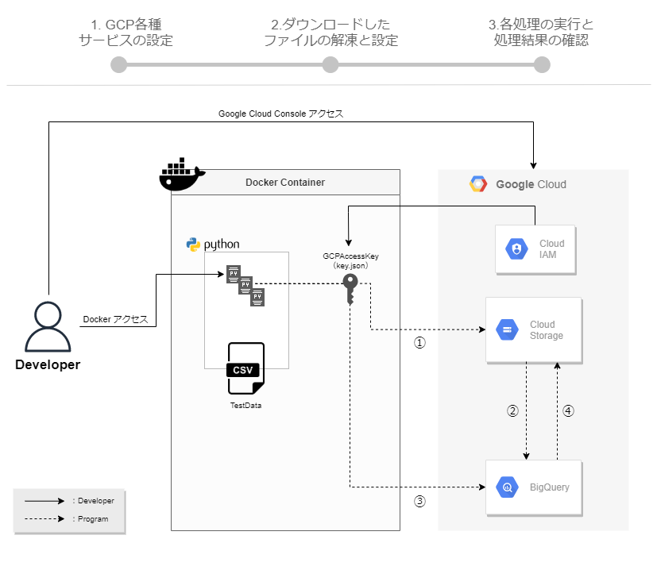

# GCP初心者必見！ PythonでBigQueryの操作をしてみよう！  
第24回目の開催となるmirameetの題材はGCP初心者必見★  
今回のハンズオンはGoogle Cloud Storageの開発Tipsも取り込んだ内容になっています！  

---

## 事前準備
- Dockerインストール
- GCPアカウントの作成

## 今回の流れ
  
Pythonで、以下処理を行うプログラムを実行します。  
①CSVファイルをGCS(GoogleCloudStrage)へアップロード  
②アップロードしたデータをBigQueryにインサート  
③BigQueryにインサートしたデータを更新・削除  
④BigQuery内のテーブルデータをGCSへエクスポート  

## 技術要素
公式サイトのリンクを記載しておきますので、参考にお使いください。  
- [GCP](https://console.cloud.google.com/?hl=ja)
- [Docker](https://www.docker.com/)
- [python](https://www.python.jp/)

## 手順
全体手順としては次の流れで進めます。  
 0.事前準備内容の確認  
 1.GCP各種サービスの設定  
 2.ダウンロードしたファイルの解凍と設定  
 3.各処理の実行と処理結果の確認  

---

Windows/Macの方向けに作成しております。  
コマンドラインツールは、個々の利用しているもので良いのですが、今回の手順は次のものを利用します。  
- Windows：コマンドプロンプト
- Mac：ターミナル
